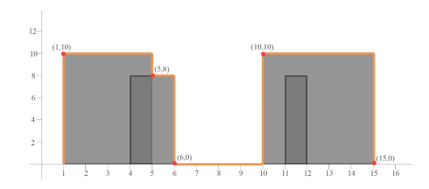

# process-rise-drops
This Repository contains the code that gives rise and drops from the input of rectangular coordinates of starting x, ending x, height of rectangle  

A set of Rectangular Card boards are arranged on the X Y axis, the inputs are cardboard indices in the format (x1,x2,h)  

  x1 - Begin Index X Axis  
  x2 - End Index X Axis  
  h - Height (Y  Axis)  

Card boards can be  arranged in the intersecting manner, partially or fully subsumed, as a solution listing the outline listing the rise and drop. For the example given below, following is the:

Input  - [(1,5,10),(4,6,8),(10,15,10),(11,12,8)]  
Output - [(1,10),(5,8),(6,0),(10,10),(15,0)]  

